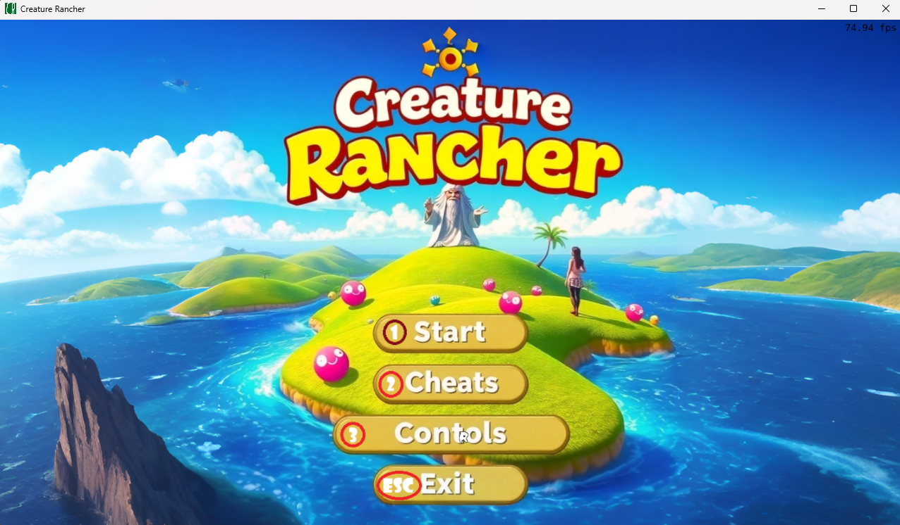
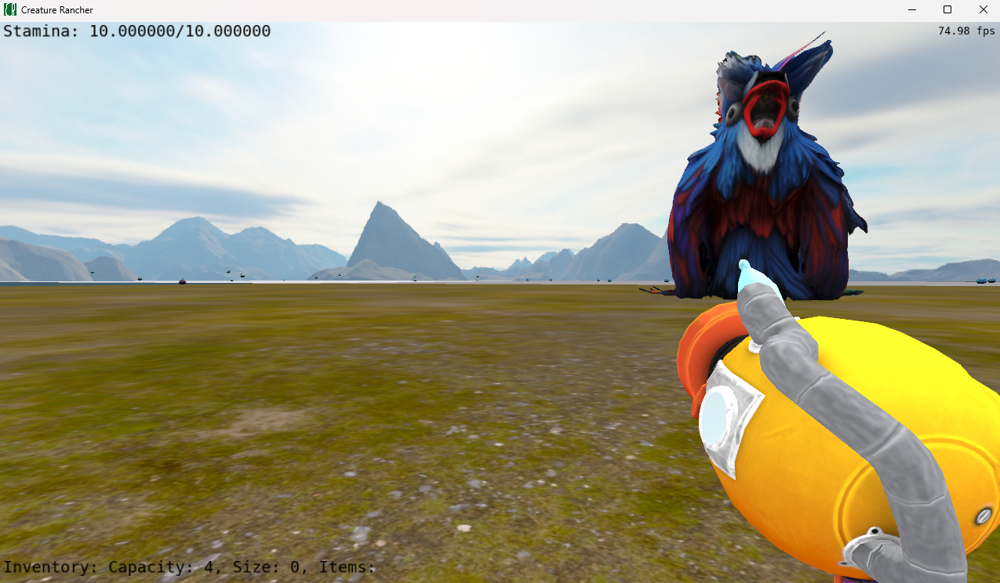
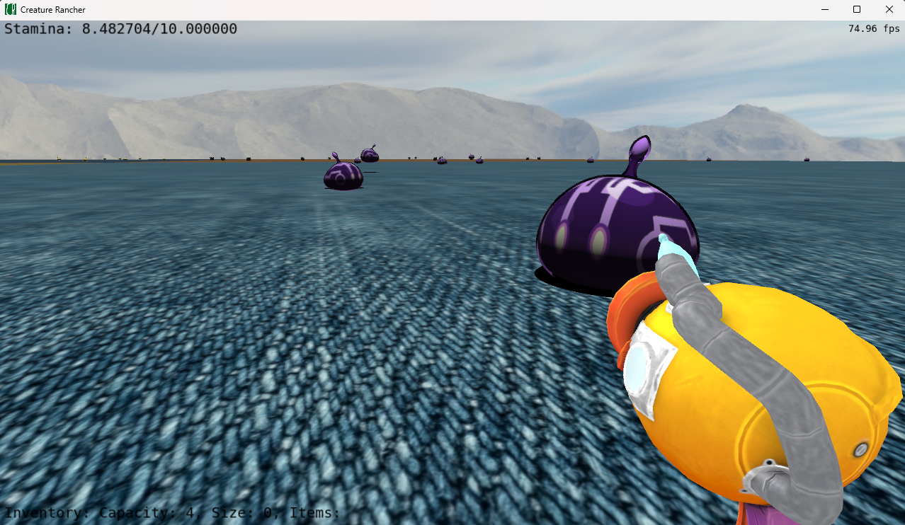
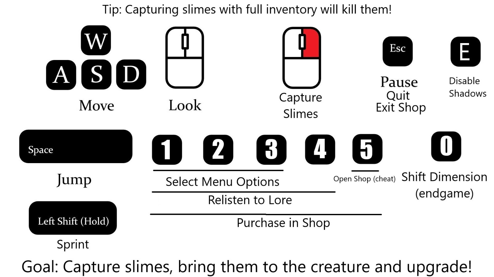

# CreatureRancher

**Objetivo do Jogo:**
Capturar slimes, comprar upgrades e avançar na história do jogo!

**Inspiração**
Jogo inspirado em Slime Rancher.

## Imagens

### Menu

### Criatura que vende Upgrades

### Slimes

## Integrantes:
- Augusto Mattei Grohmann (00550429)
- Tiago Vier Preto (00335523)

## Distribuição de Tarefas

| Critérios Técnicos                                     | Integrante    |
|--------------------------------------------------------|---------------|
| Malhas poligonais complexas                            | Augusto e Tiago |
| Transformações geométricas controladas pelo usuário    | Augusto e Tiago |
| Câmera livre e câmera look-at                          | Augusto e Tiago |
| Instâncias de objetos                                  | Augusto e Tiago |
| Três tipos de testes de interseção                     | Tiago           |
| Modelos de Iluminação Difusa e Blinn-Phong             | Tiago           |
| Modelos de Interpolação de Phong e Gouraud             | Augusto         |
| Mapeamento de texturas em todos os objetos             | Augusto e Tiago |
| Movimentação com curva Bézier cúbica                   | Tiago           |
| Animações baseadas no tempo ($\Delta t$)               | Tiago           |

| Functionalidades Extras                                | Integrante    |
|--------------------------------------------------------|---------------|
| Efeitos Sonoros                                        | Augusto         |
| Sombras                                                | Augusto         |
| Menu Principal                                         | Augusto         |
| Instâncias de objetos                                  | Augusto         |

## Uso de IA

O ChatGPT foi utilizado para auxiliar no Debug em certos trechos de código (como no desenvolvimento da SkyBox e no sistema de Colisões) e para o aperfeiçoamento de outros e, apesar de ser uma ferramenta útil, por diversas vezes seu uso não apresentava resultados satisfatórios mas produzia códigos que possibilitavam "insights" para os integrantes codificarem sua própria solução. Além disso, utilizou-se a ferramenta GitHub Copilot como "autocomplete" no editor de código Visual Studio Code para otimizar o tempo de desenvolvimento em certas ocasiões. Por fim, foram utilizadas ferramentas de IA para produzir imagens, modelos (*.obj), texturas e vozes presentes no jogo de forma automática para acelerar o desenvolvimento. 

## Descrição do Processo de Desenvolvimento

### Malhas Poligonais Complexas
- A aplicação carrega modelos geométricos no formato .obj utilizando a biblioteca tinyobjloader.
- O código inclui o processamento de malhas poligonais, como a função ComputeNormals() para normalização e BuildTrianglesAndAddToVirtualScene() para renderização.
- O objeto god.obj é um modelo geométrico com complexidade igual ou maior que o modelo "cow.obj".

### Transformações Geométricas Controladas pelo Usuário
- Translações e rotações de objetos são controladas pelo teclado e mouse. Exemplo disso, é quando o usuário aperta o botao direito do mouse para interagir com os slimes, modificando a posicao dos slimes ao longo do tempo através de curvas cúbicas de Bézier.
- A câmera permite controle dinâmico através de callbacks do teclado e mouse.

### Câmera Livre e Câmera Look-at
- A câmera look-at é implementada para menus e exibição de cenas específicas, como no menu principal e no final do jogo.
- A câmera livre usa coordenadas esféricas para se mover no espaço 3D, controlada por variáveis como g_CameraTheta e g_CameraPhi.

### Instâncias de Objetos
- Vários objetos utilizam a mesma malha básica, com matrizes Model para posicionamento (e.g., slimes e terrenos).
- São geradas instancias de vários objetos de uma mesma classe de slime (utilizando os arquivos creature.cpp e slime_types.cpp) para todas as classes de slimes e, para cada objeto, é utilizado o mesmo objeto virtual (.obj) e sua respectiva textura utilzando a mesma Model Matrix para o mesmo conjunto de vértices. 

### Três Tipos de Testes de Intersecção
- Testes de colisão são implementados no arquivo collisions.cpp, possuindo testes esfera-esfera, esfera-plano e cilindro-esfera.
- Foram geradas estruturas de dados do tipo AABB para o gerenciamento de colisões na "Broad Phase" e armazenadas em um "vector" para posteriormente serem tratadas na "Narrow Phase", onde foram utilizados os testes no arquivo collisions.cpp.

### Modelos de Iluminação Difusa e Blinn-Phong
- O código simula a iluminação difusa utilizando o espalhamento uniforme da luz em uma superfície. Sua intensidade depende do ângulo entre a normal da superfície e a direção da luz. Implementado usando "float lambert = max(0, dot(n, l));"
- O modelo Blinn-Phong é uma extensão do modelo Phong, usado para simular reflexos especulares. Ele utiliza o vetor médio (half-vector) entre a direção da luz e a direção da câmera no código.

### Modelos de Interpolação de Phong e Gouraud
- A interpolação de Gouraud: no shader, a interpolação ocorre implicitamente para variáveis color e texture no objeto "god".
- A interpolação de Phong: no shader, a normal interpolada (n) é usada para calcular a iluminação em cada fragmento e é utilizada para todos os outros objetos.

### Mapeamento de Texturas em Todos os Objetos
- A maioria das texturas são carregadas por LoadTextureImage() e aplicadas aos objetos. Exemplos incluem texturas de terrenos e slimes.
- Para carregar a Skybox foi utilizada uma funcao dedicada LoadCubemap() para fazer o Bind da textura usando o parâmetro GL_TEXTURE_CUBE_MAP.
- Para que a textura não ficasse esticada, a textura do terreno foi replicada uma certa quantidade de vezes até que ela ficasse do tamanho desejado do mapa do jogo, utilizando o parâmetro GL_REPEAT.

### Movimentação com Curva Bézier Cúbica
- A movimentação suave dos slimes ao longo de uma Curva Bézier Cúbica quando o usuário interage com eles foi implementada no arquivo curve.cpp.
- A curva foi implementada para que o slime tivesse uma trajetória espiral até a arma do usuário com uma certa probabilidade de se desviar, para que o movimento tivesse a impressão de ser "caótico", semelhante à sucção de um objeto leve, por exemplo.

### Animações Baseadas no Tempo ($\Delta t$)
- Todas as animações, incluindo movimentação da câmera e slimes, são calculadas com base em delta_t para consistência independente da velocidade da CPU.

## Manual de Uso

## Compilação

O ambiente de desenvolvimento foi configurado utilizando o Visual Studio Code (VSCode) como editor de código, com o compilador MinGW para a construção do projeto e o CMake para gerenciar o processo de compilação e gerar os arquivos necessários. Todo o procedimento de configuração seguiu os passos detalhados fornecidos pelo professor, garantindo que as ferramentas estivessem corretamente integradas.

Para executar a aplicação, basta abrir o projeto no VSCode e pressionar o botão de 'play' na barra de execução, o que inicia a compilação e, em seguida, executa o programa automaticamente. Após a compilação bem-sucedida, o executável gerado, denominado main, estará localizado no diretório do projeto, dentro da pasta bin/Debug.

